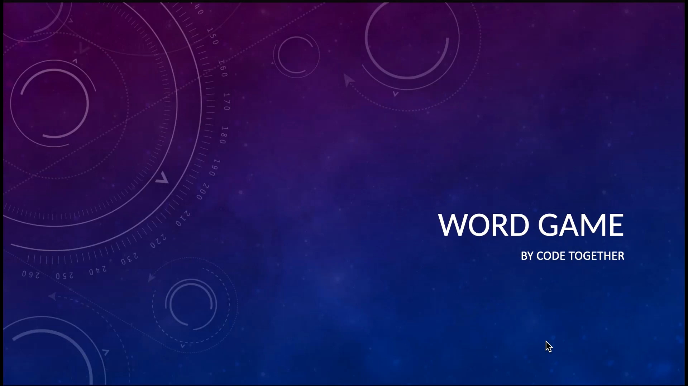
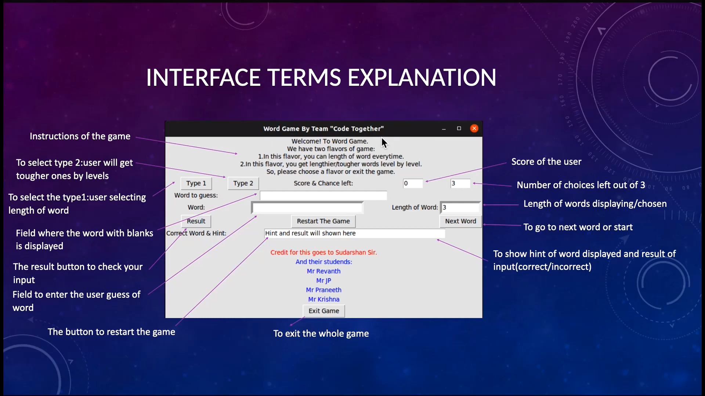
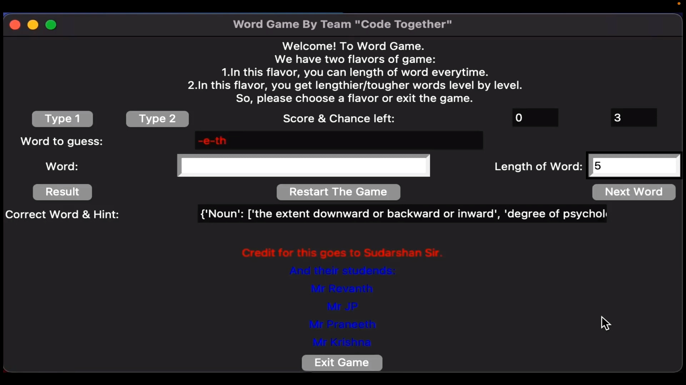

# WordGameCode
<p>
</img>
</p>

## Introduction
Our Project is a “word guessing game”. This is a game to inculcate literature and logical reasoning in the users. In this game the user is displayed with a word with certain letters of which will be missing. And the user is expected to guess those missing ones. In this way there will be certain levels of difficulty in terms of number of letters and complexity of the meaning of the words.

## Features
In this section the procedure in the game as well some logics of code are explained:
- Firstly the user will be asked to choose between the two flavours of the game,
  i. User can choose the length of word he wants to attempt and
  ii. The user will be given words level by level with increasing length.
- If he chooses the first flavor of the game, he/she will be asked to enter the length of word they want and they will be given a word of required length with random letters missing in it.
- If he chooses the second flavor in which there will be levels with increasing word length for every score increase of 5 and will be given words in levels and asked to guess missing characters.
- The user is also given with the hint of the word so as to remove the ambiguity between different words.
- For each correct guess he will be appreciated and given a point.
- The user is given three chances to attempt wrong, if he/she attempts wrong more than three times, they have to restart the game.
- A GUI(Graphical User Interface) is created to execute this game with all the functions as stated above.

## Examples and Interface
<p>
</img>
</p>

<p>
</img>
</p>


## Pre-Requisites
- Python3 or above version.
- Tkinter library should be in system for python3.
```
sudo apt-get update
sudo apt-get install python3-tk
```
- PyDictionary lib for python3 should install using pip3 along with its required dependencies, [help](https://stackoverflow.com/questions/71336856/error-pydictionary-would-not-install-on-python-3-10-2) or follow below commands.
```
python3 -m pip install -e git+https://github.com/yeahwhat-mc/goslate#egg=goslate
python3 -m pip install PyDictionary
```
- word_list.py should present in same dicrectory where wordGame is present.
